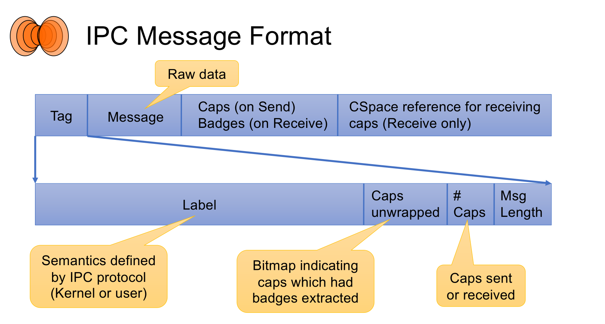

# IPC

2023.5.29 xzy


## Outcomes

1. 能够使用IPC机制在进程间收发数据和Capabilities
2. 了解*cap transfer*的含义.
3. 能够通过badge来区别来自同一endpoint的不同发送者
4. 了解如何设计使用了IPC fastpath技术的协议


## Background

IPC（进程间通信）是微内核的一个基础概念。



### 系统调用

通过IPC来实现。IPC涉及到的seL4 api有：

seL4_Send：将消息发送给另一个任务，并等待对方接收。如果对方任务没有准备好接收，发送任务将被阻塞。

seL4_NBSend：非阻塞地将消息发送给另一个任务，不等待对方接收。如果对方任务没有准备好接收，发送任务将立即返回。

seL4_Recv：接收来自其他任务的消息，并将其存储在接收者的消息寄存器中。如果没有可用的消息，接收任务将被阻塞。

seL4_NBRecv：非阻塞地接收来自其他任务的消息，如果没有可用的消息，接收任务将立即返回。

seL4_Call：将消息发送给另一个任务，并等待对方处理并回复。发送任务将被阻塞，直到收到回复。=（Send + Recv）

seL4_Reply：将回复消息发送给等待回复的任务。这通常是在收到seL4_Call消息后调用。

seL4_ReplyRecv：将回复消息发送给等待回复的任务，并接收对方的下一个消息。这是一个组合操作，用于同时发送回复并接收新消息。

seL4_CNode_SaveCaller：将当前任务的能力保存在指定的能力节点中，以便将来可以通过该能力节点找到并访问当前任务。


### IPC缓冲区

即虚拟消息寄存器，包含物理寄存器以及线程的共享内存两种类型，这两种都是消息寄存器，也就是IPC buffer。

### 数据转移

IPC的一种方式，发送端seL4_SetMR + 创建MsgInfo + 【seL4_Call（endpoint，info）/ seL4_Send(要发送的目的地址的cap,info)  / seL4_NBSend】；接收端seL4_GetMR获取内容

### Cap转移

两种方式

1. 创建MsgInfo来指定包含cap的个数 + SetCap（ipcbuffer中的cap序号，info）+ seL4_Send(要发送的目的地址的cap,info) （这里的cap需要使用seL4_CNode_SaveCaller提前保存）

2. 创建MsgInfo来指定包含cap的个数 + SetCap（ipcbuffer中的cap序号，info）+ seL4_Reply（info）（从当前上下文的调用寄存器中获取调用者）

### Capability unwrapping

seL4也可以在进程间通信（IPC）过程中解封权能(capabilities unwrapping)。如果IPC消息中的第n个能力(capability)指向发送端的endpoint，该cap将被解封：它的标记(badge)被放置到接收者的IPC缓冲区的第n个位置（在caps_or_badges字段中），并且内核会在seL4_MessageInfo_t的capsUnwrapped字段中将第n位（从最低位开始计数）设置为1。

这个机制允许接收者使用解封后的能力来访问发送者的端点或资源。通过这种方式，seL4提供了一种安全的、精确控制的能力管理机制，以确保系统的安全性和完整性。

### Message Info

发生IPC时，通信内容包括

1. 本次通信的一些基本信息，例如
   1. `length` the amount of message registers (data) in the message (`seL4_MsgMaxLength` maximum),
   2. `extraCaps` the number of capabilities in the message (`seL4_MsgMaxExtraCaps`)
   3. `capsUnwrapped` marks any capabilities unwrapped by the kernel.
   4. `label`  

​         =>存储在seL4_MessageInfo_t中

1. 消息本身 => 存储在IPC buffer中

### Badges

Badge位于进程拿到的endpoint的cap中，是一个32位整数。对于同一个endpoint，不同进程拿到的cap中包含的badge不同（注意这是seL4**机制**，需要实现**策略**来确保每个badge是各异的）。例如在一个endpoint中，一端有两个进程使用（client），一端有一个进程使用（server），对于分发给两个client进程的这个endpoint的cap，其中包含的badge不同，server进程在监听该endpoint时，拿到的消息内容中包含了badge，server端可以通过badge来区分另一端是谁在使用这个endpoint。

### Fastpath

IPC fastpath是seL4中一个重要的优化技术，它是为了在微内核系统中加速进程间通信（IPC）的。在微内核系统中，为了实现隔离，服务通常彼此分开，而IPC是客户端和服务之间通信的核心机制。因此，IPC有一个fastpath，即内核中的一条重度优化的路径，使得这些操作能够非常快速地进行。要使用fastpath，IPC必须满足以下条件：

- 必须使用`seL4_Call`或`seL4_ReplyRecv`。
- 消息中的数据必须适合放入`seL4_FastMessageRegisters`寄存器。
- 进程必须具有有效的地址空间。
- 不应该传输caps（capabilities，能力）。
- 在IPC解除阻塞的线程中，调度器中不能有优先级更高的其他线程正在运行[1](https://docs.sel4.systems/Tutorials/ipc.html)

## Code Answer

```c


#include <assert.h>
#include <sel4/sel4.h>
#include <stdio.h>
#include <utils/util.h>

// cslot containing IPC endpoint capability
extern seL4_CPtr endpoint;
// cslot containing a capability to the cnode of the server
extern seL4_CPtr cnode;
// empty cslot
extern seL4_CPtr free_slot;

int main(int c, char *argv[])
{

    seL4_Word sender;
    seL4_MessageInfo_t info = seL4_Recv(endpoint, &sender);
    while (1)
    {
        seL4_Error error;
        if (sender == 0) //sender中保存的是发送者的endpoint cap中的badge，或者信号量对象的信号量字段
        {

            /* No badge! give this sender a badged copy of the endpoint */
            seL4_Word badge = seL4_GetMR(0);
            seL4_Error error = seL4_CNode_Mint(cnode, free_slot, seL4_WordBits,
                                               cnode, endpoint, seL4_WordBits,
                                               seL4_AllRights, badge);
            printf("Badged %lu\n", badge);

            // DONE use cap transfer to send the badged cap in the reply
            // 错误：info = seL4_MessageInfo_new(0, 0, 1, 1);
            // 正确：只有cap没有data时，length字段为0，如下句
            info = seL4_MessageInfo_new(0, 0, 1, 0);
            seL4_SetCap(0, free_slot); //将ipcbuffer的cap0设置为free_slot（CPTR）指向的Cap

            /* reply to the sender and wait for the next message */
            seL4_Reply(info);

            /* now delete the transferred cap */
            error = seL4_CNode_Delete(cnode, free_slot, seL4_WordBits);
            assert(error == seL4_NoError);

            /* wait for the next message */
            info = seL4_Recv(endpoint, &sender);
        }
        else
        {

            // DONE use printf to print out the message sent by the client
            // followed by a new line
            printf("Message from %lu: ", sender);
            for (int i = 0; i < seL4_MessageInfo_get_length(info); i++)
            {
                printf("%c", seL4_GetMR(i));//GetMR(i)返回的是ipcbuffer中的msg[i]，即发送者发送的消息
            }
            printf("\n");

            // DONE reply to the client and wait for the next message

            // Way1: Seperate reply and recv
            // info = seL4_MessageInfo_new(0, 0, 0, 0);
            // seL4_Reply(info);
            // info = seL4_Recv(endpoint, &sender);

            // Way2: ReplyRecv
            info = seL4_MessageInfo_new(0, 0, 0, 0);
            info = seL4_ReplyRecv(endpoint, info, &sender);
        }
    }

    return 0;
}
```

